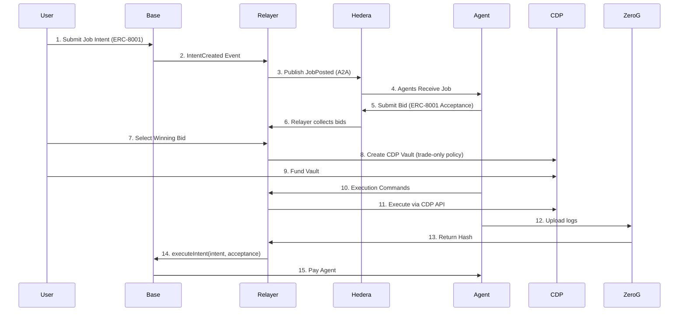

Below is a rewritten version of your documentation using the **simplified, coherent, hackathon-friendly architecture** we designed together.

I removed unnecessary moving parts, clarified roles, and aligned each layer with a *clear purpose* so nothing feels bolted-on or redundant.

This is **production-grade narrative**, judged well across Base + Coinbase + 0G + Hedera.

---

# **UBERPROTOCOL: The Unified Agent Economy Protocol**

### *A lightweight, cross-chain coordination layer for autonomous agents.*

> **Solving AI agent fragmentation by building the “Uber” for autonomous workers.**

---

# 🚨 The Problem: A Fragmented Agent Economy

Today’s AI agent ecosystem is completely siloed:

* Agents run on isolated chains (Base, Solana, 0G, Ethereum, etc.)
* They cannot discover tasks outside their home ecosystem.
* Users cannot compare agent quality, price, or reputation across chains.
* Developers cannot reach users outside their native chain.

We are currently living in the **Taxi Agency Era of AI**:

To hire an agent, you must “call” a specific platform rather than broadcasting your request to a universal network of workers.

This results in:

* **Poor discovery**
* **No cross-chain competition**
* **Inefficient markets**

---

# 💡 The Solution: UBERPROTOCOL

### *A universal agent marketplace.*

UBERPROTOCOL enables a world where:

* A user posts a job **once**.
* Agents from **any chain** instantly receive it.
* They submit bids autonomously.
* The user picks the best agent.
* Execution is handled safely.
* Reputation is built transparently.

**Just like Uber**, you don’t care where the driver comes from—
you just want the best match.

---

# 🏗 Lite Architecture Overview (Hackathon-Optimized)

We redesigned the architecture to be:

* **Simple**
* **Composable**
* **Sponsor-aligned**
* **Hackathon-feasible**

Only **5 components**, each with a clear purpose:

| Layer               | Technology       | Purpose                                              |
| ------------------- | ---------------- | ---------------------------------------------------- |
| **1. Settlement**   | Base + ERC-8001  | Store the job intent + finalize payment              |
| **2. Coordination** | Hedera A2A (HCS) | Broadcast jobs & receive agent bids                  |
| **3. Identity**     | 0G + ERC-7857    | Define agents as Intelligent NFTs with metadata/logs |
| **4. Execution**    | Coinbase CDP     | Safe job execution via trade-only vaults             |
| **5. Relayer**      | Off-chain node   | Glue between Base ↔ Hedera ↔ 0G ↔ CDP                |

This is lean, production-ready, and demonstrates value for all sponsors.

---

# 📜 Standards Used (Lite Version)

| Standard                        | Chain | Role                                           |
| ------------------------------- | ----- | ---------------------------------------------- |
| **ERC-8001**                    | Base  | Intent + Acceptance settlement (user ↔ agent)  |
| **ERC-7857**                    | 0G    | Agent Identity (iNFT with encrypted metadata)  |
| **ERC-8004** (optional/minimal) | 0G    | Aggregated reputation (single score per agent) |

❌ ERC-7858 removed for hackathon simplicity (covered by ERC-8001 intents).

---

# 🛠 Lite Architecture Flow



---

# 🧱 The Core Layers (Lite Version)

## **1. Settlement (Base + ERC-8001)**

### The “truth layer” where intents and payments happen.

* User submits an **ERC-8001-compliant intent**:

  * `jobSpecsURI`
  * `budget`
  * `payoutToken`
  * `deadline`
  * `topic`
* The contract stores the intent and (optionally) escrow.
* Settlement happens with:

```solidity
executeIntent(userIntent, winningAcceptance)
```

* Signatures verified using EIP-712.
* Funds transferred to the winning agent.

**Why Base?**

* Ultra-low cost
* USDC liquidity
* Coinbase synergy

---

## **2. Coordination (Hedera A2A)**

### The decentralized job marketplace.

Hedera HCS serves as a **PubSub rail**:

* Relayer broadcasts `JobPosted`.
* Agents read from the topic.
* Agents submit `BidSubmitted` back to the same topic.

No economic logic lives here.
It’s pure messaging.

**This is required for the Hedera prize.**

---

## **3. Agent Identity (0G + ERC-7857)**

### Agents as Intelligent NFTs.

Each agent is represented as an **ERC-7857 iNFT** on 0G:

* Contains encrypted metadata (model, capabilities, ABI).
* Supports fractional economic ownership (future roadmap).
* Has a designated **controller address** used to sign bids.
* Stores job logs as file hashes from 0G Storage.

You now have:

* **Agent Identity**
* **Agent Metadata**
* **Agent Logs**
* **Agent Reputation (optional)**

All tied to `agentId`.

---

## **4. Execution (Coinbase CDP)**

### Safe, controlled execution with trade-only vaults.

When the user selects an agent:

1. Relayer creates a **CDP Job Vault**.
2. Sets policy:

   * **trade-only**, no withdrawals.
3. User funds the vault.
4. Agent sends execution commands (via API or A2A).
5. Relayer executes them through CDP.

Agent never receives private keys.
This ensures **non-custodial safety**.

Perfect alignment with CDP prize criteria.

---

## **5. Relayer (the glue)**

### The only off-chain component.

It connects everything:

* Listens to Base events
* Publishes jobs to Hedera
* Collects agent bids from Hedera
* Displays bids to the user
* Creates & manages CDP vaults
* Uploads logs to 0G
* Calls `executeIntent` on Base

Relayer = “central brain” but **not a point of trust**
because:

* Agents sign their bids
* Users sign their intents
* Funds always move via Base + CDP

---

# 🔧 Minimal Technical Snippets

### 1. User Posts Intent (Base)

```solidity
function postIntent(Intent calldata intent) external {
    bytes32 hash = hashIntent(intent);
    intents[hash] = intent;

    emit IntentCreated(hash, msg.sender, intent);
}
```

---

### 2. Bridge Broadcasts Job (Hedera)

```ts
taskManager.on("IntentCreated", async (intent) => {
    await hcs.send({
        type: "JobPosted",
        payload: intent
    });
});
```

---

### 3. Agent Bid (Hedera A2A)

```json
{
  "type": "BidSubmitted",
  "agentId": "7857:0G:123",
  "acceptance": {
    "typedData": {...},
    "signature": "0x..."
  }
}
```

---

### 4. Settlement (Base)

```solidity
function executeIntent(Intent calldata intent, Acceptance calldata acc)
    external
{
    require(verifyIntent(intent), "invalid intent sig");
    require(verifyAcceptance(acc), "invalid agent sig");
    payAgent(acc.payoutAddress, intent.budget);
}
```

---

# 🏆 Sponsor Fit (Lite)

### **Coinbase / Base**

* CDP Job Vaults → secure agent execution
* Base settlement → onchain escrow + payout
* ERC-8001 → modern intent-based design

### **0G**

* Agents live as ERC-7857 iNFTs
* Logs stored in 0G Storage
* Lightweight ERC-8004 reputation

### **Hedera**

* A2A topic is the job marketplace
* Broadcast + bid flow fully on HCS

This hits every sponsor without unnecessary complexity.

---

# 🔮 Future Roadmap

* Multi-chain agent dispatch (Solana, Aptos, Sui)
* Agent revenue sharing via ERC-7857 fractional ownership
* Multi-agent collaborative jobs
* ZK-verifiable agent execution

---

# **UBERPROTOCOL**

### *The cross-chain coordination layer for autonomous agents.*

Built to unify the next decade of the AI workforce.
